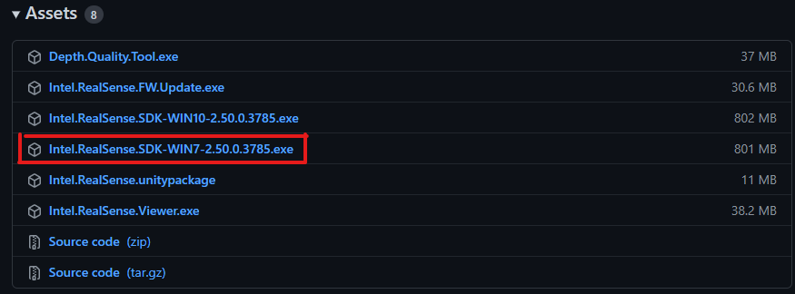

# PIBITI-RealsenseDepth

> A Câmera de Profundidade Intel RealSense D435 usa visão estéreo para calcular a profundidade. A D435 é uma câmera de profundidade alimentada por USB e consiste em um par de sensores de profundidade, sensor RGB e projetor infravermelho. Foi projetada para caber em protótipos possuindo obturador de imagem global e amplo campo de visão, a Camera D435 oferece uma percepção de profundidade precisa quando o objeto ou o dispositivo está em movimento, e cobre mais área, minimizando "pontos cegos".

### Caracteristicas:
Captura e Gravação: 

    DEPTH: 1280 x 720 a 90fps.
    Field Of View (FOV) Depth: 87° x 58°.
    Precisão: Menor que 2% a 2 metros.
    
    RGB: 1920 x 1080 a 30fps. 
    RGB FOV: 69° x 42°. 
    RGB sensor resolution: 2MP.

- USB: 3.1 primeira geração
- Distancia ideal:

        Minima: 30 cm.
        Maxima: 3 m.
    
# Instruções de Instalação 

## Windows

O **Intel® RealSense™ SDK 2.0** fornece as ferramentas necessarias para instalação e uso de maneira rapida. Acesse um dos links a seguir para instruções mais completas: 
- [GitHub Releases](https://github.com/IntelRealSense/librealsense/releases)
- https://github.com/IntelRealSense/librealsense/releases/tag/v2.50.0

## Intel RealSense Viewer

- Baixe e instale o **Intel.RealSense.Viewer.exe**:
**Link de Download Direto:** https://github.com/IntelRealSense/librealsense/releases/download/v2.50.0/Intel.RealSense.Viewer.exe

- Neste ponto já é possivel começar a manipular os dados de profundidade:

Fonte: librealsense Doc, 2021.

## Instalando o SDK
* Baixe e execute o **Intel.RealSense.SDK-WINXX-2.50.0.3785.exe**:
**Link de Download Direto SDK WIN10:** https://github.com/IntelRealSense/librealsense/releases/download/v2.50.0/Intel.RealSense.SDK-WIN10-2.50.0.3785.exe

Para windows 7 acesso o link a seguir [GitHub Releases](https://github.com/IntelRealSense/librealsense/releases) vá até **Assets** e selecione a versão.

1.  O Intel® RealSense™ SDK 2.0 é distribuído sob a licença de código aberto permissivo Apache 2.0:

2.  O SDK já inclui o Viewer e o Quality Tool, além de outros pacotes de ferramentas para desenvolvimento em outras linguagéns de programação:

3. Marque se deseja os shortcuts na Area de Trabalho:

4. Confira se esta tudo certo e clique em Instalar e aguarde o termino:

5. Pronto!!
Agora você pode abrir o `Intel® RealSense™ Samples` e ver alguns exemplos ou executar o `Intel® RealSense™ Viewer`/`Intel® RealSense™ Quality Tool` e começar a realizar seus proprios testes.

### Requesitos para desenvolvimento Python
python 3.7 ou superior
pip install pyrealsense2
pip install numpy
pip install matplotlip
pip install open3d
pip install opencv-python
pip install Pillow

## Codigos de Exemplo Alternativos com a Camera:
- [Exemplo 1](./src/tracking.py)
- [COLOCAR 2](./src/tracking.py)
- [COLOCAR 3](./src/tracking.py)